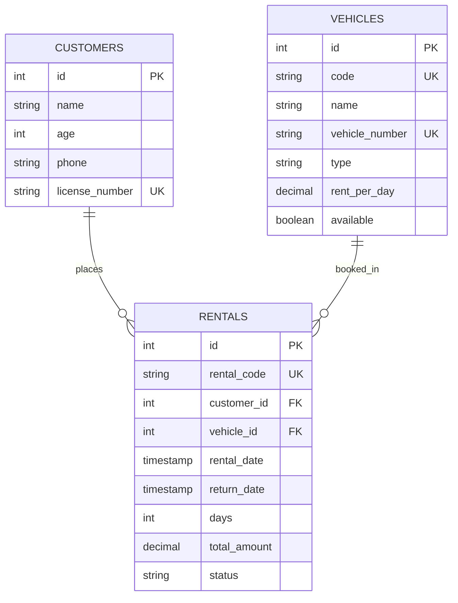
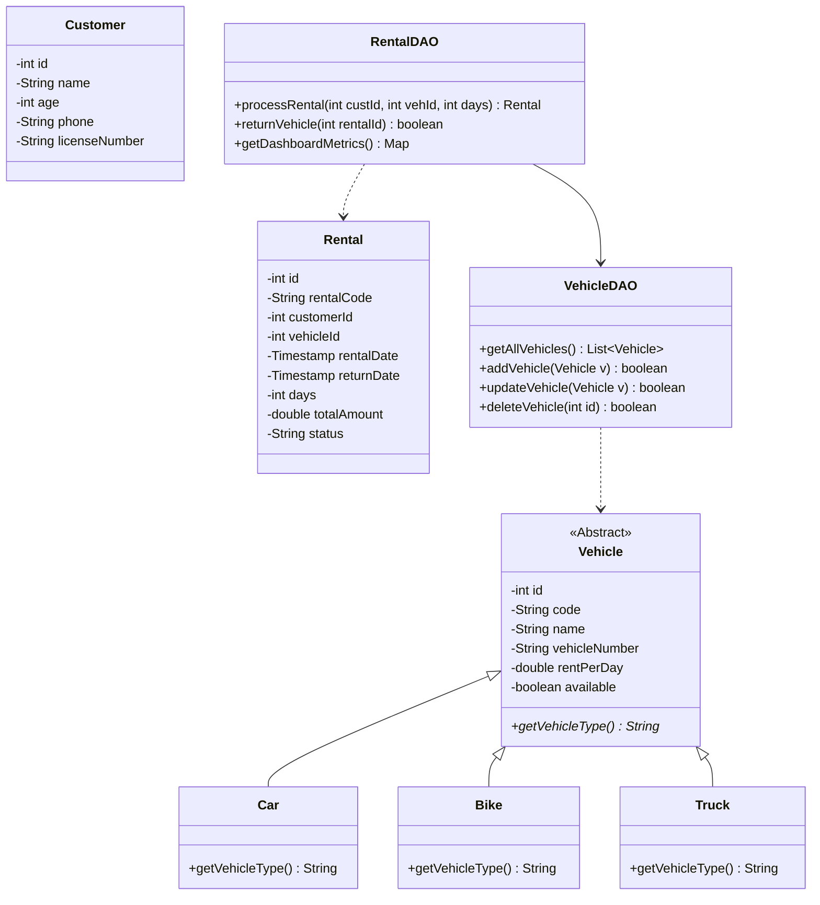

# Vehicle Rental Management System
**KTU S3 Object Oriented Programming (OOP) Micro-Project**

A complete, production-ready **Vehicle Rental Management System** built with HTML5, CSS3, Vanilla JavaScript, Java Servlets, JDBC, and MySQL.

---

## 📋 Table of Contents
1. [Project Overview](#-project-overview)
2. [Key Features](#-key-features)
3. [Object-Oriented Programming (OOP) Design](#-object-oriented-programming-oop-design)
4. [System Architecture & Directory Structure](#-system-architecture--directory-structure)
5. [Database & ER Diagram](#-database--er-diagram)
6. [Class Diagram](#-class-diagram)
7. [Main Algorithms](#-main-algorithms)
8. [Installation & Setup Guide](#-installation--setup-guide)
9. [Test Cases & Validation Results](#-test-cases--validation-results)

---

## 🚗 Project Overview

### Problem Statement
Vehicle rental businesses face operational challenges in tracking vehicle availability, customer records, daily rental tariffs, returns, and total revenue. Manual bookkeeping often leads to double-booking errors, incorrect billing, and lost records.

### Objectives
- Automate fleet availability tracking (`AVAILABLE` vs `RENTED`).
- Provide instant dynamic price calculation (`Total = Rent/Day × Days`).
- Ensure transactional database consistency (ACID compliant rental booking).
- Maintain permanent records in MySQL without relying on transient frontend storage.
- Provide a clean, modern user interface for micro-project evaluation.

---

## ✨ Key Features

1. **Dashboard & Fleet Overview**: Real-time fleet metrics (Total Vehicles, Available, Rented, Total Customers, Active Rentals, Total Revenue).
2. **Vehicle Management (CRUD)**: Add, view, edit, search, filter (by type and availability), and delete vehicles.
3. **Customer Management**: Register customers with age verification (&ge; 18 yrs), 10-digit phone validation, and unique driving license checking.
4. **Interactive Rental Booking**: Live price calculation updating instantly as rental duration or vehicle choice changes. Generates official Rental Receipts.
5. **Transactional Return Processing**: Atomic status transition (`ACTIVE` &rarr; `RETURNED`) that automatically restores vehicle status to `AVAILABLE`.
6. **Complete Rental Audit Log**: Full rental history with status filtering and search.

---

## 🧩 Object-Oriented Programming (OOP) Design

This micro-project strictly demonstrates core Java OOP principles:

### 1. Abstraction
- Abstract class [`model.Vehicle`](file:///c:/Users/user/Desktop/vehichle%20rental%20app/src/model/Vehicle.java) defines common properties (`id`, `code`, `name`, `vehicleNumber`, `rentPerDay`, `available`) and declares abstract method `public abstract String getVehicleType();`.

### 2. Inheritance
- Subclasses [`model.Car`](file:///c:/Users/user/Desktop/vehichle%20rental%20app/src/model/Car.java), [`model.Bike`](file:///c:/Users/user/Desktop/vehichle%20rental%20app/src/model/Bike.java), and [`model.Truck`](file:///c:/Users/user/Desktop/vehichle%20rental%20app/src/model/Truck.java) inherit from `Vehicle`.

### 3. Method Overriding & Polymorphism
- Each subclass overrides `getVehicleType()` to return `"Car"`, `"Bike"`, or `"Truck"`.
- [`dao.VehicleDAO`](file:///c:/Users/user/Desktop/vehichle%20rental%20app/src/dao/VehicleDAO.java) dynamically instantiates `Car`, `Bike`, or `Truck` instances at runtime based on database records.

### 4. Encapsulation
- All fields in `Vehicle`, `Customer`, and `Rental` models are `private` and accessed exclusively via public getters and setters.

### 5. DAO Pattern & Separation of Concerns
- Business domain objects (`model`), data persistence (`dao`), HTTP request handling (`servlet`), and connection management (`util`) are cleanly decoupled.

---

## 🏗️ System Architecture & Directory Structure

```text
vehichle rental app/
├── database/
│   └── schema.sql                 [MySQL Database Creation & Initial Seeds]
├── lib/
│   ├── javax.servlet-api-4.0.1.jar
│   ├── mysql-connector-j-8.3.0.jar
│   └── h2-2.2.224.jar             [Embedded DB Engine Fallback]
├── src/
│   ├── model/
│   │   ├── Vehicle.java           [Abstract Base Class]
│   │   ├── Car.java               [Subclass]
│   │   ├── Bike.java              [Subclass]
│   │   ├── Truck.java             [Subclass]
│   │   ├── Customer.java          [Customer Model]
│   │   └── Rental.java            [Rental Transaction Model]
│   ├── dao/
│   │   ├── VehicleDAO.java        [Vehicle JDBC Operations]
│   │   ├── CustomerDAO.java       [Customer JDBC Operations]
│   │   └── RentalDAO.java         [Rental JDBC & Transaction Handling]
│   ├── servlet/
│   │   ├── DashboardServlet.java  [API: /api/dashboard]
│   │   ├── VehicleServlet.java    [API: /api/vehicles]
│   │   ├── CustomerServlet.java   [API: /api/customers]
│   │   ├── RentalServlet.java     [API: /api/rentals]
│   │   └── ReturnVehicleServlet.java [API: /api/returns]
│   ├── util/
│   │   └── DatabaseConnection.java [JDBC Connection & Auto Schema Init]
│   └── ServerRunner.java          [Standalone Java HTTP Server & Runner]
├── web/                           [Frontend Assets]
│   ├── index.html                 [Dashboard View]
│   ├── vehicles.html              [Vehicles Fleet Management]
│   ├── customers.html             [Customer Directory]
│   ├── rent.html                  [Rental Booking & Price Calculator]
│   ├── return.html                [Vehicle Return Processing]
│   ├── history.html               [Rental Audit Log]
│   ├── css/
│   │   └── styles.css             [Custom Design System & Glassmorphism UI]
│   └── js/
│       ├── main.js                [Core Utilities, Toasts, Modals]
│       ├── dashboard.js           [Dashboard Data Controller]
│       ├── vehicles.js            [Vehicles Controller]
│       ├── customers.js           [Customers Controller]
│       ├── rent.js                [Rental & Price Calculation Controller]
│       ├── return.js              [Return Controller]
│       └── history.js             [History Audit Controller]
├── compile_and_run.bat            [Windows Automated One-Click Launcher]
├── run.sh                         [Unix/macOS Launcher]
├── pom.xml                        [Maven Build File]
└── README.md                      [Documentation]
```

---

## 🗄️ Database & ER Diagram

### MySQL Database: `vehicle_rental`

#### Relational Entities:
1. `vehicles` (1) &mdash;&mdash;&lt; (Many) `rentals`
2. `customers` (1) &mdash;&mdash;&lt; (Many) `rentals`



---

## 📐 Class Diagram



---

## 🧮 Main Algorithms

### Algorithm 1: Dynamic Price Calculation Formula
$$\text{Total Amount} = \text{Rent Per Day} \times \text{Number of Rental Days}$$

Example:
$$\text{Honda City (₹2,000/day)} \times 3 \text{ Days} = ₹6,000$$

### Algorithm 2: Transactional Vehicle Booking Process (ACID Compliant)
1. **Begin Transaction**: `connection.setAutoCommit(false);`
2. **Verify Customer**: Select customer by `id`. Ensure `age >= 18`.
3. **Check Availability**: Select vehicle by `id`. If `available == false`, throw `VehicleUnavailableException`.
4. **Calculate Total**: `totalAmount = rentPerDay * days`.
5. **Insert Rental**: Insert record into `rentals` table with `status = 'ACTIVE'`.
6. **Update Vehicle**: Set `available = FALSE` in `vehicles` table.
7. **Commit Transaction**: `connection.commit();`. On any failure, execute `connection.rollback();`.

---

## 🚀 Installation & Setup Guide

### System Requirements
- Java SE Development Kit (JDK 8 or higher)
- MySQL Server (Optional &mdash; auto-connects to MySQL if running on port 3306, otherwise auto-initializes embedded H2 database engine)

### Running on Windows
Double-click [`compile_and_run.bat`](file:///c:/Users/user/Desktop/vehichle%20rental%20app/compile_and_run.bat) or execute in PowerShell:
```powershell
.\compile_and_run.bat
```
Then open your web browser at: **`http://localhost:8080/`**

### Running on Linux / macOS
```bash
chmod +x run.sh
./run.sh
```

---

## 🧪 Test Cases & Validation Results

| Test Case # | Description | Test Inputs | Expected Outcome | Result |
| :--- | :--- | :--- | :--- | :---: |
| **TC-01** | Add valid vehicle | Code: `V104`, Name: `Creta`, Reg: `KL 07 CZ 9999`, Rent: `1800` | Vehicle added successfully | **PASS** |
| **TC-02** | Add duplicate vehicle code | Code: `V101` (already exists) | Rejected: Code already exists | **PASS** |
| **TC-03** | Register valid customer | Name: `Arjun Nair`, Age: `24`, Phone: `9876543210`, License: `KL-07-20220011` | Customer registered successfully | **PASS** |
| **TC-04** | Customer below 18 years | Age: `16` | Rejected: Must be at least 18 years old | **PASS** |
| **TC-05** | Invalid phone number | Phone: `9876` (4 digits) | Rejected: Must contain 10 digits | **PASS** |
| **TC-06** | Rent available vehicle | Vehicle: `V101` (Honda City), Customer: `Arjun Nair`, Days: `3` | Receipt generated (Total ₹6,000), Status &rarr; Rented | **PASS** |
| **TC-07** | Attempt rent on already rented vehicle | Vehicle: `V101` (currently rented) | Rejected: Vehicle unavailable | **PASS** |
| **TC-08** | Invalid rental days | Days: `-2` or `0` | Rejected: Days must be > 0 | **PASS** |
| **TC-09** | Correct total calculation | ₹2,000/day &times; 3 days | Total Amount = ₹6,000 | **PASS** |
| **TC-10** | Return vehicle | Rental ID: `RNT-897575` | Status &rarr; `RETURNED`, Vehicle &rarr; `AVAILABLE` | **PASS** |
| **TC-11** | Search vehicle by name/code | Query: `Honda` or `V101` | Filters table to Honda City | **PASS** |
| **TC-12** | Search customer | Query: `Arjun` | Filters directory to Arjun Nair | **PASS** |
| **TC-13** | View rental history | Open History page | Displays returned record with audit timestamps | **PASS** |
